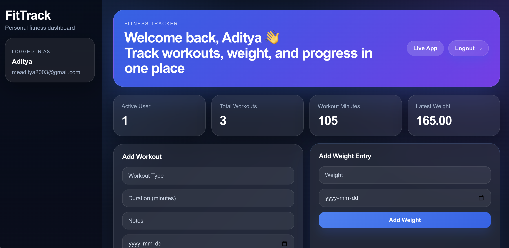
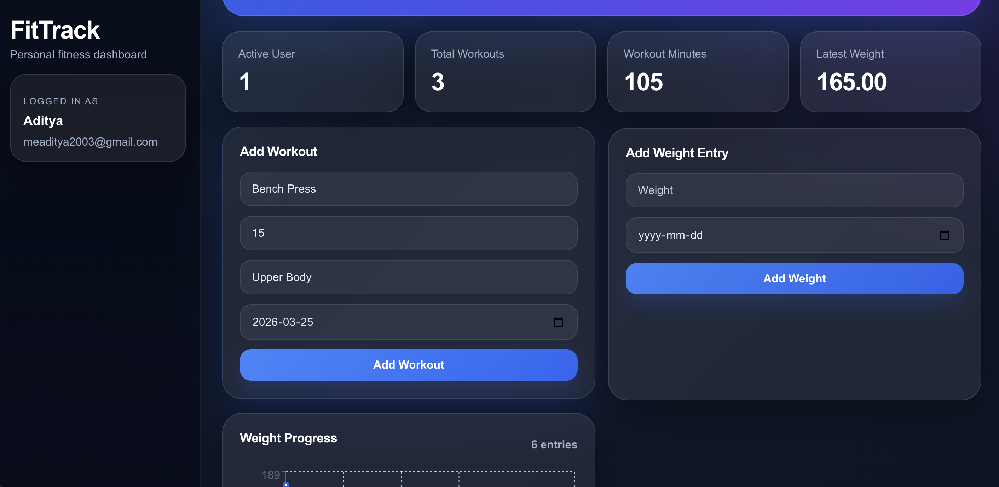
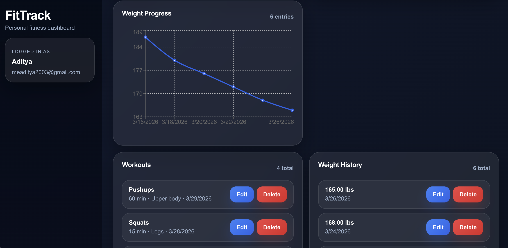

# FitTrack — Full Stack Fitness Tracker

FitTrack is a full-stack fitness tracking web application where users can create an account, log in securely, add workouts, track body weight, and visualize progress through a clean and modern dashboard.

---

## 🚀 Live Demo

- 🌐 Frontend: https://fitness-tracker-apkizg5dk-adityashah78s-projects.vercel.app/
- ⚙️ Backend API: https://fitness-tracker-t55t.onrender.com

---

## 📸 Screenshots

### Dashboard



### Forms



### Data View



---

## ✨ Features

- User signup and login with JWT authentication
- Secure password hashing using bcrypt
- Create, edit, and delete workouts
- Create, edit, and delete weight entries
- Personalized dashboard per user
- Weight progress chart (Recharts)
- Summary cards (total workouts, minutes, latest weight)
- Clean and responsive UI
- Real-time success/error feedback (toast notifications)

---

## 🛠️ Tech Stack

### Frontend

- React
- JavaScript
- CSS
- Recharts

### Backend

- Node.js
- Express.js
- JWT Authentication
- bcrypt

### Database

- PostgreSQL

### Deployment

- Vercel (Frontend)
- Render (Backend + PostgreSQL)

---

## 📁 Project Structure

```text
fitness-tracker/
├── backend/
│   ├── src/
│   │   ├── config/
│   │   └── app.js
│   ├── package.json
│   └── .env
├── frontend/
│   ├── public/
│   │   └── screenshots/
│   ├── src/
│   │   ├── App.js
│   │   ├── App.css
│   │   ├── Auth.js
│   │   └── Toast.js
│   └── package.json
└── README.md
```

---

## ⚙️ Local Setup

### 1. Clone the repository

```bash
git clone https://github.com/AdityaShah78/fitness-tracker.git
cd fitness-tracker
```

---

### 2. Backend Setup

```bash
cd backend
npm install
```

Create a `.env` file in `/backend`:

```env
DATABASE_URL=your_postgres_connection_string
JWT_SECRET=your_secret_key
```

Run backend:

```bash
npm run dev
```

👉 Runs on: http://localhost:3001

---

### 3. Frontend Setup

```bash
cd frontend
npm install
npm start
```

👉 Runs on: http://localhost:3000

---

## 🔌 API Overview

### Users

- `POST /users` → Create user
- `POST /login` → Authenticate user
- `GET /users` → Get all users
- `GET /users/:id` → Get user by ID
- `PUT /users/:id` → Update user
- `DELETE /users/:id` → Delete user

### Workouts

- `POST /workouts` → Add workout
- `GET /workouts/:userId` → Get user workouts
- `PUT /workouts/:id` → Update workout
- `DELETE /workouts/:id` → Delete workout

### Weights

- `POST /weights` → Add weight entry
- `GET /weights/:userId` → Get weight entries
- `PUT /weights/:id` → Update weight
- `DELETE /weights/:id` → Delete weight

---

## 🧠 How the App Works

1. Users sign up or log in securely using JWT authentication
2. Passwords are hashed using bcrypt before storage
3. After login, the frontend stores the token locally
4. Users can add workouts and weight entries tied to their account
5. The dashboard fetches user-specific data from the backend
6. Weight data is visualized using charts for progress tracking

---

## 🚀 Deployment Notes

- Frontend deployed on Vercel
- Backend deployed on Render
- PostgreSQL database hosted on Render

⚠️ Note:
Render free-tier databases may expire after inactivity or trial limits.
For production use, upgrading or migrating to a persistent database is recommended.

---

## 👨‍💻 Author

**Aditya Shah**

- Email: meaditya2003@gmail.com
- GitHub: https://github.com/AdityaShah78
- LinkedIn: linkedin.com/in/aditya-shah-d78

---

## 📌 Summary

This project demonstrates:

- Full-stack development (React + Node.js + PostgreSQL)
- REST API design and integration
- Authentication and secure data handling
- Modern UI/UX design
- Deployment using real-world tools (Vercel + Render)

---
